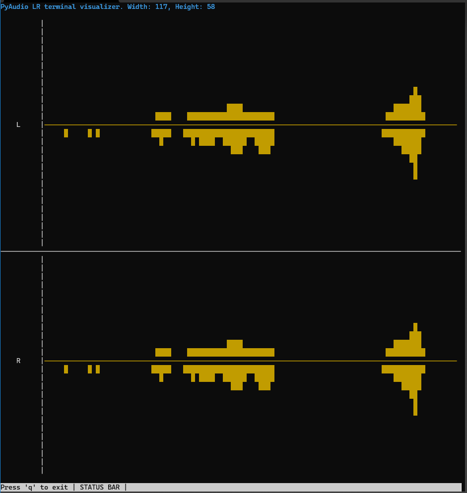

# Audio analyzer in Python3 for Pi


## Install requirements
```
python3 -m pip3 install -r requirements.txt

```

For Pi users, if cannot install numpy, install via `apt`.

```
sudo apt install python3-numpy
```


## Visualizer in terminal
`visualizer_terminal.py`

Used:
- Python3
- PyAudio
- Numpy
- Curses

Image:

